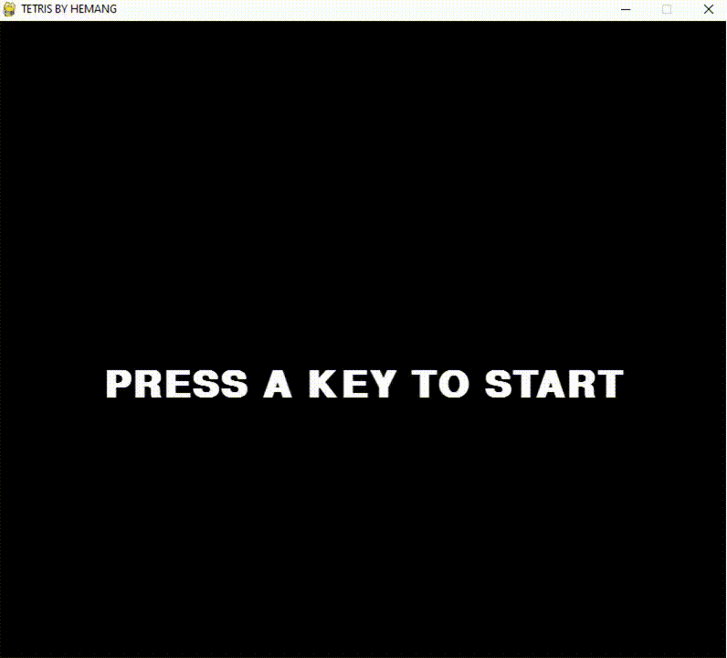

# Tetris

<h2><a href="https://github.com/hemangsharma/Tetris/blob/main/TETRIS.exe?raw=true" download>Click here</a> to download exe file</h2> 
<h2><a href="https://github.com/hemangsharma/Tetris/blob/main/TETRIS.app.zip?raw=true" download>Click here</a> to download app (for mac)<h2> 
Tetris has very simple rules: you can only move the pieces/tetriminos in specific ways. Your game is over if your pieces reach the top of the screen and you can 
only remove pieces from the screen by filling all the blank space in a line. Tetriminos will descend from the top of the field.Use Left and Right arrow key to 
move the Tetriminos and use Up arrow key to rotate the tetriminos. 
 
 

